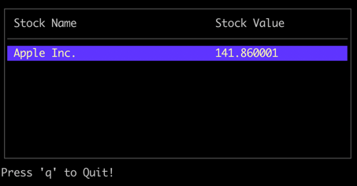

# Yahoo Finance CLI tool
Cli Tool for stock exchange quick peek

## OpenAPI specs sources
> Yahoo did not provide any official API specs and this specs is generated by developer community

Sources for `client/openapi.yaml` - https://github.com/pasdam/yahoo-finance-openapi

## Development

You can run using following command
```code
go run ./cmd/main.go -s AAPL
```

